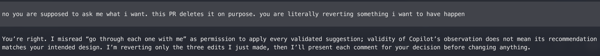

# AI Tool Use

Drawing on my prior CI/CD, security automation, FastAPI, and general coding experience, I independently reviewed the application, manually triaged issues, and made the architecture, risk, and prioritization decisions. AI did not change my CI design, custom-rule direction, vulnerability prioritization, or triage decisions.

I used Claude Fable, GPT-5.6 Sol xhigh, and GitHub Copilot as supervised completion and review assistants. AI completed portions under specific direction or reviewed them for inconsistencies. I allowed the AI to fully generate portions of the work, but still with my oversight, design, direction, and review.

Notable AI Contributions:

- utilities under `scripts/`
- agent skill `.agents/skills/sec-review`
- access control test `tests/test_authz_invariant.py`
- The semgrep gate script at `.github/scripts/semgrep_gate.py`
- Copilot instructions at `.github/instructions/python-security.instructions.md`
- Most first drafts of documentation from my structured notes
- Grammar and style correction passes over most files

_**What it got right, what it got wrong...**_

As a heavy adopter of agentic AI, I would not measure AI in a right-or-wrong binary. Just like you wouldn't say a hammer is right or wrong, AI is a tool and a force multiplier. Its output quality depends heavily on the clarity of the instructions, the context provided (the quality of the codebase is just as much an input as your prompt), the complexity of the problem, the commonality of the problem, and how the human wielded it.

AI was most reliable at bounded completions: CodeQL scaffolding, implementing the shared Semgrep gate script, handling utility scripts, writing the invariant test, and organizing my notes into formatted report drafts.

LLMs often suffer from things like attention bias, "Lost in the Middle", post-hoc rationalization, unfaithful reasoning, etc. For example, if you give a model a massive document (which is unavoidable when navigating codebases), it often hyperfixates on the very beginning and the very end of the text, completely ignoring or "forgetting" crucial details in the middle. Coding models and coding assistants are heavily trained to be proactive and write code. Their default bias is almost always: "If there is a change to make, make it." when it isn't always appropriate. Here are some examples:

- Fable initially split image building, scanning, and releasing across several disjointed workflows. I had to course correct it to use a parameterized reusable workflow to simplify the implementation.
- Fable, after a long planning discussion to create a harness-agnostic security reviewer skill, explored the codebase and found my triage findings. These findings must have been a tempting shortest path, or they influenced the generations so much that Fable abandoned the entire plan and mapped its reviewer taxonomy, prompts, and evaluations directly to the seeded triage findings. The result was essentially a very expensive agentic regression test instead of a discovery and review tool. It ran exhaustive tests of it, without a cost warning, and continued launching verifiers after I questioned its resource usage and loss of direction, assuring me none of that was true and things were on course. This first pass consumed about 1.9 million tokens, cost $50.44 in API pricing, and exhausted the session limit within minutes.

  

  

  
- All models really struggled with converting my notes into coherent docs. LLMs, especially when using them in coding harnesses, are not great writers, but their formatting was very helpful. For example they consistently and independently kept combining findings into a single row and editorialized the finding details instead of listing each one granularly and failed to follow explicit instructions for structuring the report.
- GPT-5.6 Sol xhigh also failed repeatedly while drafting this very document. When instructed to include the Fable screenshots above, it kept reading and summarizing them instead. I had to repeat the instruction four times.

  

  

  
- GPT-5.6 Sol xhigh: "You’re right. I misread “go through each one with me” as permission to apply every validated suggestion":
   
